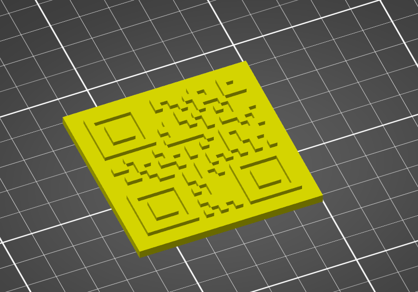

# qr-stl

A program that will generate STL files for QR codes. These STLs are suitable for
making coasters (e.g. for [WiFi passwords if you use the appropriate
format](https://github.com/zxing/zxing/wiki/Barcode-Contents#wi-fi-network-config-android-ios-11))
and other interesting projects.



## Usage:

Download a release from the [releases page](releases). Make it executable (if
on Linux) with `chmod +x qr-stl-linux`.

```
$ echo 'your message here' | ./qr-stl -o your-output.stl
```

Further customization is supported:

```
OPTIONS:
        --base-height <base-height>    height of the base to put on the qr code [default: 3.0]
        --base-size <base-size>        width of the base to put on the qr code [default: 5.0]
    -i, --input <input>                input text file for the qr content
    -o, --output <output>              output file path
        --pixel-size <pixel-size>      size in units of pixels in the generated qr code [default: 2.5]
```

## Development

This software requires a Rust compiler. Install one from your operating
system repositories or use [rustup](https://rustup.rs).

Run with `cargo run -- -o output.stl`.

## Project information

This project is licensed under the MIT license. Everyone is expected to
follow our Contributor Covenant Code of Conduct in spaces for this project.